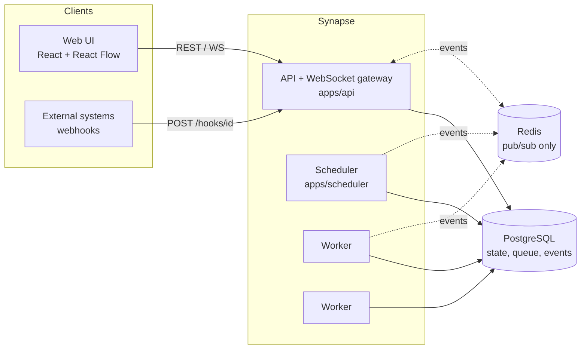
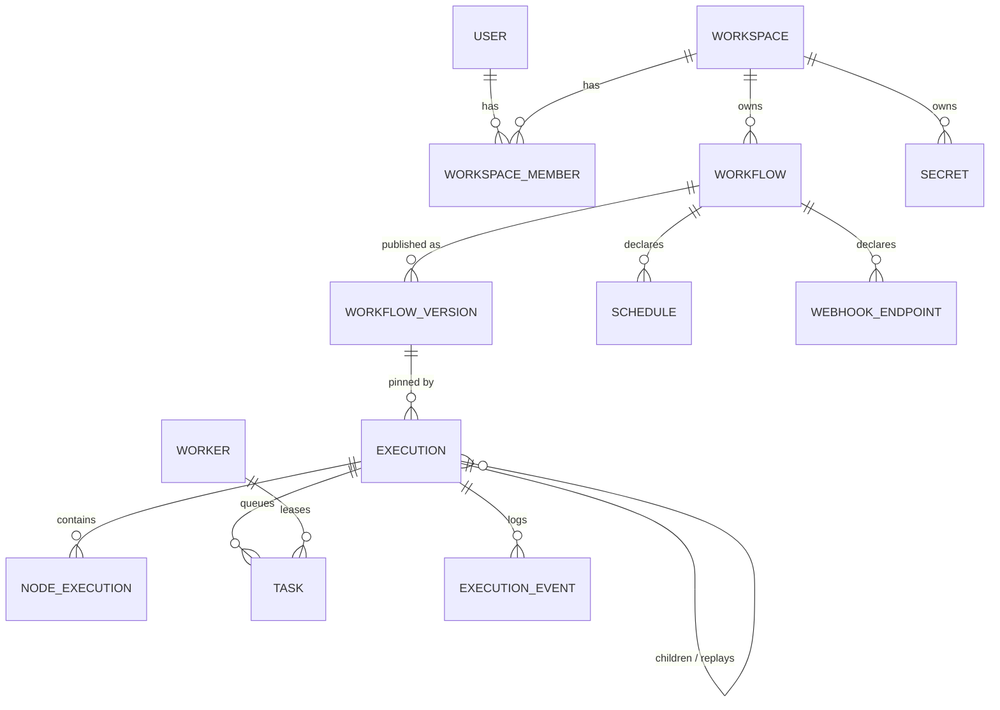
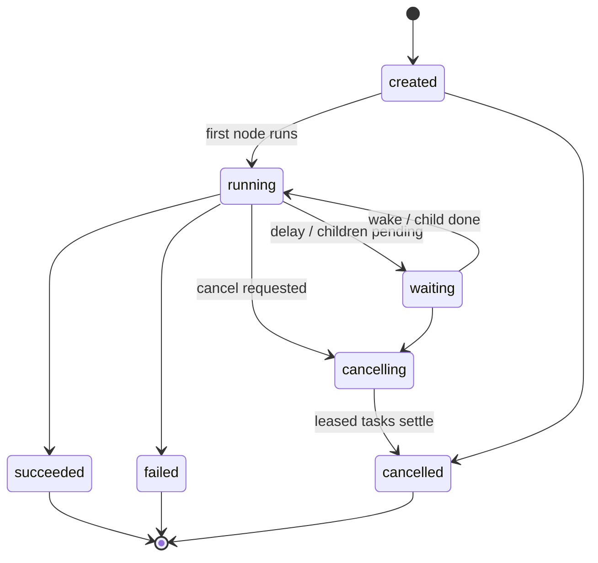
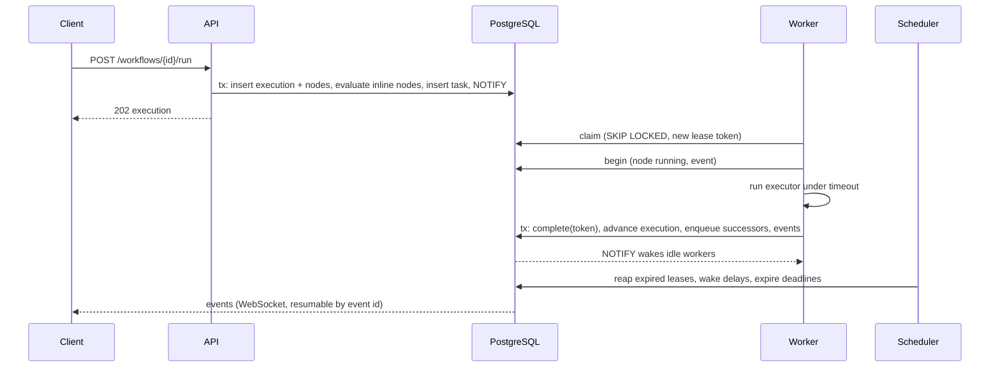
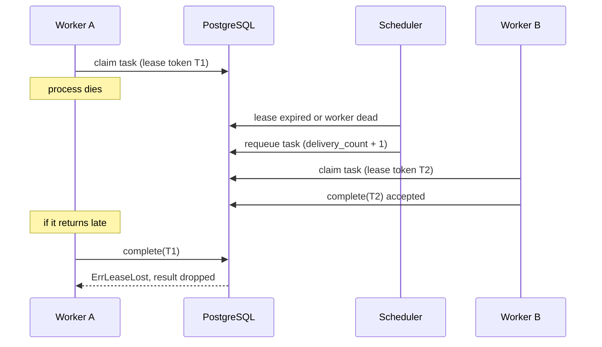

# Synapse architecture

Synapse runs user-authored workflow DAGs durably across a pool of workers. PostgreSQL is the only authoritative store; Redis is an optional latency optimisation for live updates.

## Components

- **API** (`apps/api`) serves REST, webhook ingress and WebSockets. It can also run the scheduler in-process (`SYNAPSE_RUN_SCHEDULER`).
- **Scheduler** (`apps/scheduler`) fires cron schedules and runs the maintenance loops: wake delayed nodes, expire deadlines, reap dead leases, sweep unacknowledged child completions. Every loop is idempotent, so several instances are safe.
- **Workers** (`apps/worker`) claim tasks, run node executors, heartbeat leases and report results.
- **PostgreSQL** holds workflows, versions, executions, node state, the task queue and the event log.
- **Redis** forwards committed events between processes so an API replica can push events produced by a worker on another host. Nothing depends on it for correctness.

## Domain model

A workflow is a graph of typed nodes and edges (branch-labelled for conditions and loops). Publishing freezes the graph into an immutable version; executions reference a version, never the mutable draft (ADR 0004).

## Execution lifecycle

Node states are `pending → queued → running → succeeded | failed | skipped | cancelled`, with `retrying` between failed attempts and `waiting` for delays and child executions.

## How a run flows

The whole advance step happens under the execution row lock, so two workers finishing sibling nodes at once serialise cleanly and never both decide the execution is complete.

## Failure recovery

See ADR 0002 and 0003 for delivery semantics and the reaper.

## Real-time events

Every state change inserts into `execution_events` inside the transaction that made it. After commit the runtime offers the events to an in-process hub. Each WebSocket subscriber has a bounded queue; a subscriber that cannot keep up is told to `resync` and closed. Clients reconnect with `?after=<last_event_id>` and the server replays from the table, and the handler also tails the table every two seconds, so delivery converges even if the hub or Redis drops a message (ADR 0006).

## Nodes

| Type | Runs | Notes |
| --- | --- | --- |
| `manual_trigger`, `webhook_trigger`, `schedule_trigger` | inline | Output is the trigger payload. |
| `condition` | inline | Branches `true` / `false`; the other branch is skipped. |
| `merge` | inline | Joins active incoming branches. |
| `delay` | inline | Durable wait (`run_at`), survives restarts. |
| `foreach` | inline | Fans out child executions (bounded concurrency), then the `done` branch. |
| `sub_workflow` | inline | Starts a child execution, depth-limited. |
| `stop` | inline | Ends the execution with a chosen status. |
| `transform`, `http_request`, `log`, `email` | worker | Queued, leased, retried per policy. |

Inline nodes are evaluated by the pure core in `internal/engine` inside the execution transaction; worker nodes go through the queue (ADR 0009).

## Security model

- Sessions are opaque random tokens stored hashed; passwords use argon2id. Cookie sessions carry a CSRF double-submit token; Bearer tokens are exempt.
- Roles per workspace: viewer < member < admin < owner. Non-members receive 404 rather than 403 so workspace ids cannot be probed.
- Webhooks verify an HMAC signature (`X-Synapse-Signature`) with constant-time comparison and are rate limited.
- `http_request` blocks private, loopback and link-local addresses by default (SSRF guard) and re-checks on redirects and after DNS resolution.
- Secrets are AES-256-GCM encrypted and masked in output (ADR 0010).

## Observability

- **Metrics**: `/metrics` on the API and on each worker/scheduler ops port. Queue depth by status, oldest ready task age, workers and executions by status, task and execution durations, retries, lease losses, WebSocket clients and drops, HTTP request rate and latency by route.
- **Tracing**: OpenTelemetry over OTLP/HTTP when `OTEL_EXPORTER_OTLP_ENDPOINT` is set. An execution stores the W3C `traceparent` of the request that created it (`executions.traceparent`), so a worker's node span joins the trace that started the run even though it runs in another process.
- **Logs**: JSON, with `request_id`, `workflow_id`, `execution_id`, `node_id`, `worker_id`, `attempt`, and `trace_id`/`span_id` when a span is active.

The `synapse_executions` and `synapse_queue_tasks` gauges are computed at scrape time with `GROUP BY` queries; on a very large `executions` table, scrape less often or drop them.

## Package map

| Package | Responsibility |
| --- | --- |
| `internal/workflow` | Graph model, validation, indexes, retry policy. |
| `internal/expressions` | Lexer, parser, evaluator, checker, templates. |
| `internal/engine` | Pure scheduling core and inline node evaluation. |
| `internal/runtime` | Durable execution: creation, queue, leases, replay, children. |
| `internal/worker`, `internal/scheduler` | Task execution loop; maintenance loops. |
| `internal/nodes` | Worker node executors (HTTP with SSRF guard, transform, log, email). |
| `internal/triggers` | Cron schedules, webhook endpoints. |
| `internal/api`, `internal/realtime` | HTTP/WS surface; hub and Redis bus. |
| `internal/auth`, `internal/secrets` | Identity, sessions, roles; encrypted secrets. |
| `internal/persistence`, `migrations` | Pool, transactions, SQL migrations. |
| `internal/telemetry`, `internal/tracing`, `internal/logging` | Metrics, tracing, logs. |
| `packages/protocol` | TypeScript contracts checked against Go by a drift test. |
